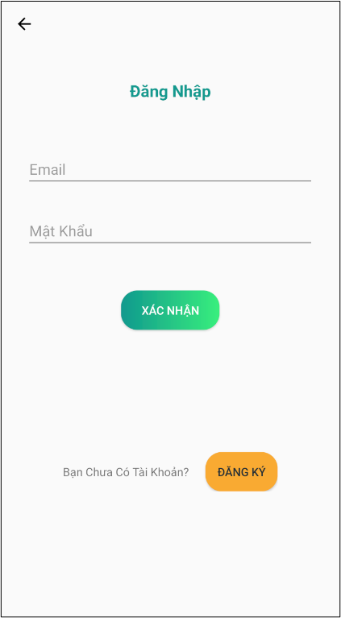
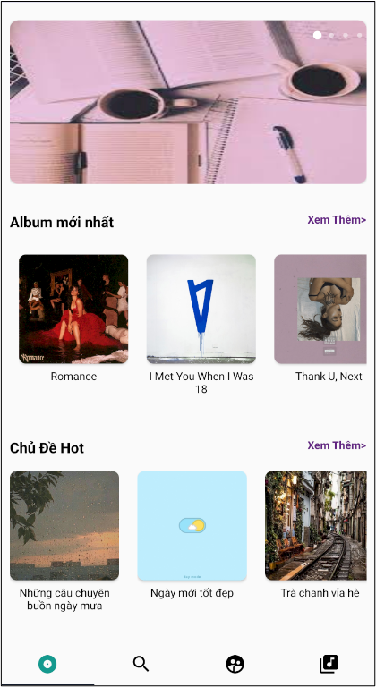
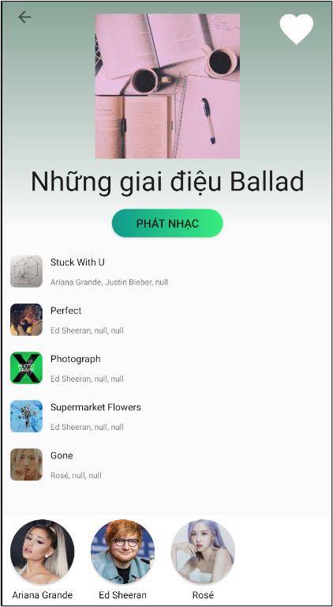
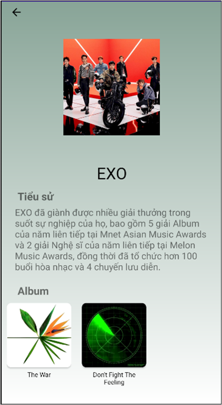
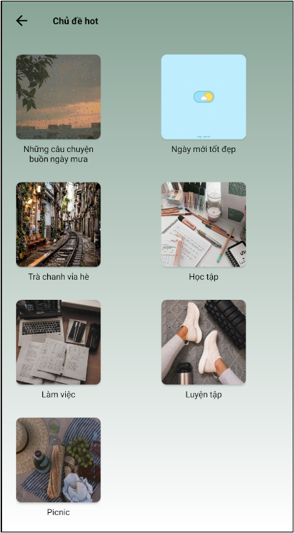
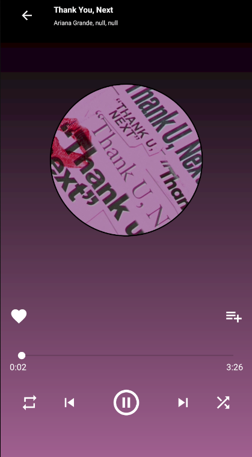

The project used to make a web server for the project Android This site was built using [music-app](https://github.com/chuminhtan/music-app). Admin manage song from the admin page, and then the server provides song through API for app.

  
  
  
  
  
  
  
  
  

